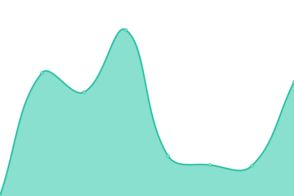
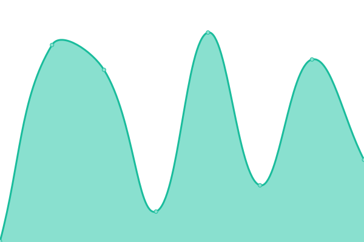
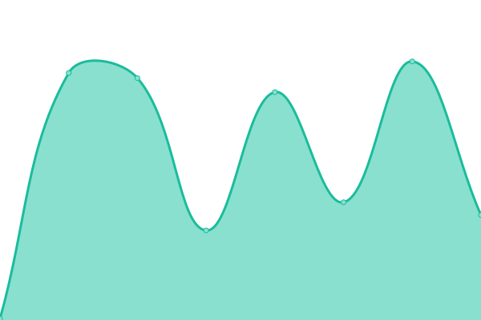
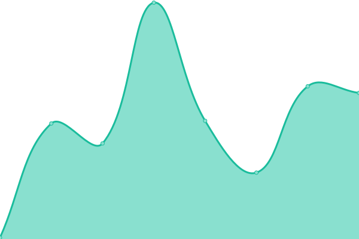
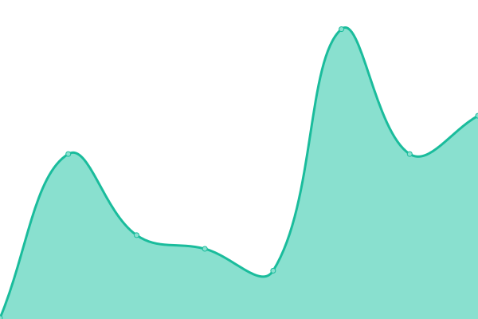

# [📈 Live Status](https://status.sman3palu.sch.id): <!--live status--> **🟧 Partial outage**

This repository contains the open-source uptime monitor and status page for [SMA Negeri 3 Palu](https://sman3palu.sch.id), powered by [Upptime](https://github.com/upptime/upptime).

With [Upptime](https://upptime.js.org), you can get your own unlimited and free uptime monitor and status page, powered entirely by a GitHub repository. We use [Issues](https://github.com/smantriplw/uptime-services/issues) as incident reports, [Actions](https://github.com/smantriplw/uptime-services/actions) as uptime monitors, and [Pages](https://status.sman3palu.sch.id) for the status page.

<!--start: status pages-->
<!-- This summary is generated by Upptime (https://github.com/upptime/upptime) -->
<!-- Do not edit this manually, your changes will be overwritten -->
<!-- prettier-ignore -->
| URL | Status | History | Response Time | Uptime |
| --- | ------ | ------- | ------------- | ------ |
|  [Website](https://sman3palu.sch.id) | 🟥 Down | [website.yml](https://github.com/smantriplw/uptime-services/commits/HEAD/history/website.yml) | 

 1075ms
     
 | 

<a href="https://status.sman3palu.sch.id/history/website">0.00%</a>
    

|  [Dokumentasi/Foto Website](https://dokumentasi.sman3palu.sch.id/owncloud) | 🟥 Down | [dokumentasi-foto-website.yml](https://github.com/smantriplw/uptime-services/commits/HEAD/history/dokumentasi-foto-website.yml) | 

 4488ms
     
 | 

<a href="https://status.sman3palu.sch.id/history/dokumentasi-foto-website">98.14%</a>
    

|  [Verval Website](https://verval.sman3palu.sch.id) | 🟥 Down | [verval-website.yml](https://github.com/smantriplw/uptime-services/commits/HEAD/history/verval-website.yml) | 

 0ms
     
 | 

<a href="https://status.sman3palu.sch.id/history/verval-website">0.00%</a>
    

|  [ERapor K13 Website](https://ek13.sman3palu.sch.id) | 🟥 Down | [e-rapor-k13-website.yml](https://github.com/smantriplw/uptime-services/commits/HEAD/history/e-rapor-k13-website.yml) | 

 3860ms
     
 | 

<a href="https://status.sman3palu.sch.id/history/e-rapor-k13-website">0.00%</a>
    

|  [ERapor Kelas 12 Website](https://erapor12.sman3palu.sch.id) | 🟥 Down | [e-rapor-kelas-12-website.yml](https://github.com/smantriplw/uptime-services/commits/HEAD/history/e-rapor-kelas-12-website.yml) | 

 0ms
     
 | 

<a href="https://status.sman3palu.sch.id/history/e-rapor-kelas-12-website">0.00%</a>
    

|  [ERapor KM Website](https://ekm.sman3palu.sch.id) | 🟥 Down | [e-rapor-km-website.yml](https://github.com/smantriplw/uptime-services/commits/HEAD/history/e-rapor-km-website.yml) | 

 2290ms
     
 | 

<a href="https://status.sman3palu.sch.id/history/e-rapor-km-website">0.00%</a>
    

|  [Dapodik Portal](https://dapodik.sman3palu.sch.id) | 🟩 Up | [dapodik-portal.yml](https://github.com/smantriplw/uptime-services/commits/HEAD/history/dapodik-portal.yml) | 

 1881ms
     
 | 

<a href="https://status.sman3palu.sch.id/history/dapodik-portal">98.15%</a>
    

|  [SNBTX Website](https://snbtx.sman3palu.sch.id) | 🟥 Down | [snbtx-website.yml](https://github.com/smantriplw/uptime-services/commits/HEAD/history/snbtx-website.yml) | 

 0ms
     
 | 

<a href="https://status.sman3palu.sch.id/history/snbtx-website">0.00%</a>
    

|  [SNBP Mirror](https://snbp.sman3palu.sch.id) | 🟩 Up | [snbp-mirror.yml](https://github.com/smantriplw/uptime-services/commits/HEAD/history/snbp-mirror.yml) | 

 726ms
     
 | 

<a href="https://status.sman3palu.sch.id/history/snbp-mirror">100.00%</a>
    

|  [MikroTik](https://routeros.sman3palu.sch.id) | 🟥 Down | [mikro-tik.yml](https://github.com/smantriplw/uptime-services/commits/HEAD/history/mikro-tik.yml) | 

 10847ms
     
 | 

<a href="https://status.sman3palu.sch.id/history/mikro-tik">0.00%</a>
    

|  [[EXTERNAL] Telkom ASTinet Monitoring](https://telkomcare.telkom.co.id/mrtgnetcare2) | 🟩 Up | [external-telkom-as-tinet-monitoring.yml](https://github.com/smantriplw/uptime-services/commits/HEAD/history/external-telkom-as-tinet-monitoring.yml) | 

 4956ms
     
 | 

<a href="https://status.sman3palu.sch.id/history/external-telkom-as-tinet-monitoring">99.71%</a>
    

|  [[EXTERNAL] Kemdikbud VervalPD](https://vervalpd.data.kemdikbud.go.id) | 🟩 Up | [external-kemdikbud-verval-pd.yml](https://github.com/smantriplw/uptime-services/commits/HEAD/history/external-kemdikbud-verval-pd.yml) | 

 2802ms
     
 | 

<a href="https://status.sman3palu.sch.id/history/external-kemdikbud-verval-pd">100.00%</a>
    

|  [[EXTERNAL] Kemdikbud Datadik](https://datadik.kemdikbud.go.id/acc/login) | 🟩 Up | [external-kemdikbud-datadik.yml](https://github.com/smantriplw/uptime-services/commits/HEAD/history/external-kemdikbud-datadik.yml) | 

 2511ms
     
 | 

<a href="https://status.sman3palu.sch.id/history/external-kemdikbud-datadik">98.57%</a>
    

<!--end: status pages-->

[**Visit our status website →**](https://status.sman3palu.sch.id)

## 📄 License

- Powered by: [Upptime](https://github.com/upptime/upptime)
- Code: [MIT](./LICENSE) © [Anand Chowdhary](https://anandchowdhary.com), supported by [Pabio](https://pabio.com)
- Data in the `./history` directory: [Open Database License](https://opendatacommons.org/licenses/odbl/1-0/)
