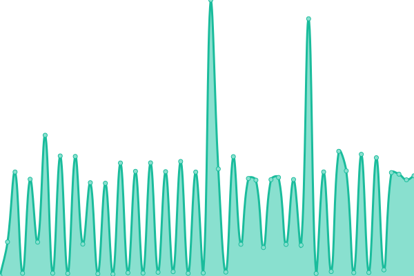
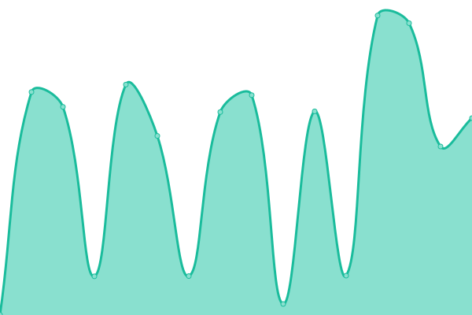
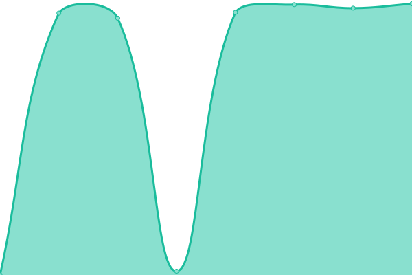
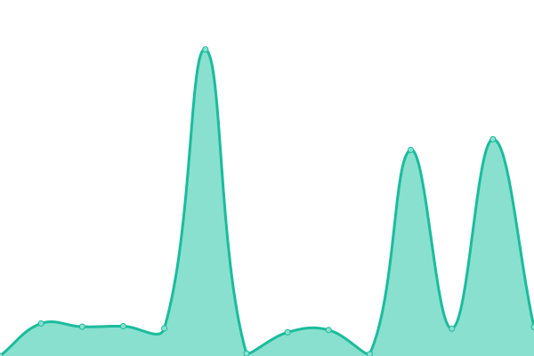
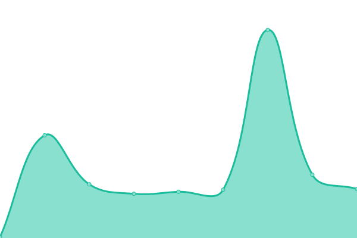
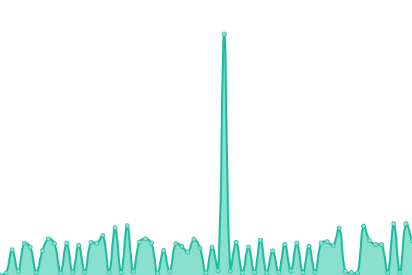

# [📈 Live Status](https://status.sman3palu.sch.id): <!--live status--> **🟧 Partial outage**

This repository contains the open-source uptime monitor and status page for [SMA Negeri 3 Palu](https://sman3palu.sch.id), powered by [Upptime](https://github.com/upptime/upptime).

With [Upptime](https://upptime.js.org), you can get your own unlimited and free uptime monitor and status page, powered entirely by a GitHub repository. We use [Issues](https://github.com/smantriplw/uptime-services/issues) as incident reports, [Actions](https://github.com/smantriplw/uptime-services/actions) as uptime monitors, and [Pages](https://status.sman3palu.sch.id) for the status page.

<!--start: status pages-->
<!-- This summary is generated by Upptime (https://github.com/upptime/upptime) -->
<!-- Do not edit this manually, your changes will be overwritten -->
<!-- prettier-ignore -->
| URL | Status | History | Response Time | Uptime |
| --- | ------ | ------- | ------------- | ------ |
|  [Website](https://sman3palu.sch.id) | 🟥 Down | [website.yml](https://github.com/smantriplw/uptime-services/commits/HEAD/history/website.yml) | 

 1895ms
     
 | 

<a href="https://status.sman3palu.sch.id/history/website">99.19%</a>
    

|  [Dokumentasi/Foto Website (tunnel)](https://dokumentasi.sman3palu.sch.id/owncloud) | 🟥 Down | [dokumentasi-foto-website-tunnel.yml](https://github.com/smantriplw/uptime-services/commits/HEAD/history/dokumentasi-foto-website-tunnel.yml) | 

 2461ms
     
 | 

<a href="https://status.sman3palu.sch.id/history/dokumentasi-foto-website-tunnel">99.19%</a>
    

|  [CBT (Computer Based Test) Website (proxmox)](https://cbt.sman3palu.sch.id) | 🟥 Down | [cbt-computer-based-test-website-proxmox.yml](https://github.com/smantriplw/uptime-services/commits/HEAD/history/cbt-computer-based-test-website-proxmox.yml) | 

 0ms
     
 | 

<a href="https://status.sman3palu.sch.id/history/cbt-computer-based-test-website-proxmox">0.00%</a>
    

|  [Proxmox Portal Website](https://proxmox.sman3palu.sch.id) | 🟥 Down | [proxmox-portal-website.yml](https://github.com/smantriplw/uptime-services/commits/HEAD/history/proxmox-portal-website.yml) | 

 0ms
     
 | 

<a href="https://status.sman3palu.sch.id/history/proxmox-portal-website">0.00%</a>
    

|  [Gitea Website (proxmox)](https://git.sman3palu.sch.id) | 🟥 Down | [gitea-website-proxmox.yml](https://github.com/smantriplw/uptime-services/commits/HEAD/history/gitea-website-proxmox.yml) | 

 0ms
     
 | 

<a href="https://status.sman3palu.sch.id/history/gitea-website-proxmox">0.00%</a>
    

|  [Portainer Portal Website (tunnel)](https://docker.sman3palu.sch.id) | 🟩 Up | [portainer-portal-website-tunnel.yml](https://github.com/smantriplw/uptime-services/commits/HEAD/history/portainer-portal-website-tunnel.yml) | 

 1072ms
     
 | 

<a href="https://status.sman3palu.sch.id/history/portainer-portal-website-tunnel">97.82%</a>
    

|  [Portainer Portal Website for Proxmox (tunnel)](https://portainer.sman3palu.sch.id) | 🟩 Up | [portainer-portal-website-for-proxmox-tunnel.yml](https://github.com/smantriplw/uptime-services/commits/HEAD/history/portainer-portal-website-for-proxmox-tunnel.yml) | 

 718ms
     
 | 

<a href="https://status.sman3palu.sch.id/history/portainer-portal-website-for-proxmox-tunnel">97.78%</a>
    

|  [Cekdata Website (tunnel)](https://cekdata.sman3palu.sch.id) | 🟩 Up | [cekdata-website-tunnel.yml](https://github.com/smantriplw/uptime-services/commits/HEAD/history/cekdata-website-tunnel.yml) | 

 1837ms
     
 | 

<a href="https://status.sman3palu.sch.id/history/cekdata-website-tunnel">97.54%</a>
    

|  [Cekdata Website (vercel)](https://cekdata-v2.sman3palu.sch.id) | 🟩 Up | [cekdata-website-vercel.yml](https://github.com/smantriplw/uptime-services/commits/HEAD/history/cekdata-website-vercel.yml) | 

 187ms
     
 | 

<a href="https://status.sman3palu.sch.id/history/cekdata-website-vercel">100.00%</a>
    

|  [ERapor K13 Website (tunnel)](https://erapor.sman3palu.sch.id) | 🟩 Up | [e-rapor-k13-website-tunnel.yml](https://github.com/smantriplw/uptime-services/commits/HEAD/history/e-rapor-k13-website-tunnel.yml) | 

 1139ms
     
 | 

<a href="https://status.sman3palu.sch.id/history/e-rapor-k13-website-tunnel">14.65%</a>
    

|  [ERapor KM Website (tunnel)](https://eraporkm.sman3palu.sch.id) | 🟥 Down | [e-rapor-km-website-tunnel.yml](https://github.com/smantriplw/uptime-services/commits/HEAD/history/e-rapor-km-website-tunnel.yml) | 

 2198ms
     
 | 

<a href="https://status.sman3palu.sch.id/history/e-rapor-km-website-tunnel">0.00%</a>
    

|  [Dapodik Portal (tunnel)](https://dapodik.sman3palu.sch.id) | 🟥 Down | [dapodik-portal-tunnel.yml](https://github.com/smantriplw/uptime-services/commits/HEAD/history/dapodik-portal-tunnel.yml) | 

 976ms
     
 | 

<a href="https://status.sman3palu.sch.id/history/dapodik-portal-tunnel">99.06%</a>
    

|  [Proxmox Access Backup Portal (tunnel)](https://ssh-proxmox.sman3palu.sch.id) | 🟥 Down | [proxmox-access-backup-portal-tunnel.yml](https://github.com/smantriplw/uptime-services/commits/HEAD/history/proxmox-access-backup-portal-tunnel.yml) | 

 526ms
     
 | 

<a href="https://status.sman3palu.sch.id/history/proxmox-access-backup-portal-tunnel">0.00%</a>
    

|  [phpMyAdmin Portal (tunnel)](https://phpmyadmin.sman3palu.sch.id) | 🟩 Up | [php-my-admin-portal-tunnel.yml](https://github.com/smantriplw/uptime-services/commits/HEAD/history/php-my-admin-portal-tunnel.yml) | 

 1221ms
     
 | 

<a href="https://status.sman3palu.sch.id/history/php-my-admin-portal-tunnel">97.70%</a>
    

|  [Links (tunnel)](https://links.sman3palu.sch.id) | 🟥 Down | [links-tunnel.yml](https://github.com/smantriplw/uptime-services/commits/HEAD/history/links-tunnel.yml) | 

 907ms
     
 | 

<a href="https://status.sman3palu.sch.id/history/links-tunnel">98.30%</a>
    

|  [[DONATION] AmbisCamp Moodle (tunnel)](https://ambiscamp-cbt.sman3palu.sch.id) | 🟥 Down | [donation-ambis-camp-moodle-tunnel.yml](https://github.com/smantriplw/uptime-services/commits/HEAD/history/donation-ambis-camp-moodle-tunnel.yml) | 

 724ms
     
 | 

<a href="https://status.sman3palu.sch.id/history/donation-ambis-camp-moodle-tunnel">98.30%</a>
    

|  [[EXTERNAL] Telkom ASTinet Monitoring](https://telkomcare.telkom.co.id/mrtgnetcare2) | 🟩 Up | [external-telkom-as-tinet-monitoring.yml](https://github.com/smantriplw/uptime-services/commits/HEAD/history/external-telkom-as-tinet-monitoring.yml) | 

 1388ms
     
 | 

<a href="https://status.sman3palu.sch.id/history/external-telkom-as-tinet-monitoring">100.00%</a>
    

|  [[EXTERNAL] Kemdikbud VervalPD](https://vervalpd.data.kemdikbud.go.id) | 🟥 Down | [external-kemdikbud-verval-pd.yml](https://github.com/smantriplw/uptime-services/commits/HEAD/history/external-kemdikbud-verval-pd.yml) | 

 0ms
     
 | 

<a href="https://status.sman3palu.sch.id/history/external-kemdikbud-verval-pd">0.00%</a>
    

|  [[EXTERNAL] Kemdikbud Datadik](https://datadik.kemdikbud.go.id/acc/login) | 🟩 Up | [external-kemdikbud-datadik.yml](https://github.com/smantriplw/uptime-services/commits/HEAD/history/external-kemdikbud-datadik.yml) | 

 1055ms
     
 | 

<a href="https://status.sman3palu.sch.id/history/external-kemdikbud-datadik">100.00%</a>
    

<!--end: status pages-->

[**Visit our status website →**](https://status.sman3palu.sch.id)

## 📄 License

- Powered by: [Upptime](https://github.com/upptime/upptime)
- Code: [MIT](./LICENSE) © [Anand Chowdhary](https://anandchowdhary.com), supported by [Pabio](https://pabio.com)
- Data in the `./history` directory: [Open Database License](https://opendatacommons.org/licenses/odbl/1-0/)
